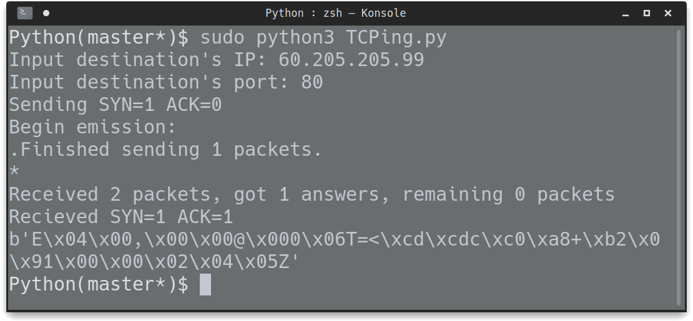

# lab 6-5 Python

### 实验方法

使用 Python 的 Scapy 库，构造 TCP 的第一次握手包，接收 TCP 的第二次握手包

即 `SYN=1 ACK=0` 和 `SYN=1 ACK=1` 包

使用 `ip = IP(dst=dst_ip)` 函数获取第一次握手包的 IP 部分

使用 `TCP(sport=33445, dport=int(dst_port), seq=100, flags="S")` 函数获取第一次握手包的 TCP 部分，其中，本地请求端口为 33445， seq 手动设置为 100，TCP 包中的 flags 字段值为 “S" 表示为 SYN

`SYNACK = sr1(ip/SYN)` 为打包 IP 与 TCP 的内容，并使用 `sr1` 函数发送至目的地址，将其返回的第二次握手包，即 `SYN=1 ACK=1` 包存放至变量 SYNACK 中

使用 root 权限运行脚本，打印过程中的相关值

### 实验结果

